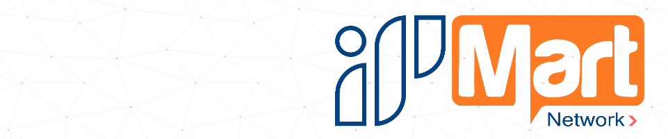

<h1 align="center">Hi 👋, I'm Ali Hassanzadeh</h1>
<h3 align="center">Software Engineer</h3>
<h4 align="Justify"> Passionate and Motivated
A spontaneous programmer in learning, active and disciplined in learning and teaching new
technologies and trying to up to date. 
I have started with C and C++ and have learned about algorithmic vision then I have met Java and have been working on it and Spring Core & Kotlin for 2 years and have learned about software engineering and design patterns;   Currently working on Machine Learning Algorithms, Unreal Engine & Web Dev.
</h6>

 

- 👨‍💻 My Personal Website [ipmart.shop](https://ipmart.shop)

- 📝 Look at my LinkedIn Account to see my Experiences, Skills & Certifications [linkedin](https://www.linkedin.com/in/ali-hassanzadeh-63545a24a/)

- 🤩 My HackerRank Profile [link](https://www.hackerrank.com/profile/hassanzadehali10)

- 💬 Ask me about **Golang, NodeJs, Java, Python, Linux, C++ and more**

- 📫 How to reach me **info@ipmart.shop** and **hassanzadehali10@gmail.com**

-  Take a look at my telegram channel if you are a Geek [Invite Link](https://t.me/ipmartpanel) 😃

-  I am not programming for money, that's a humble goal. I am programming because **I LOVE IT, LIVE FOR IT**

## Ask me about :computer: 
- **Competitive Programming**
	- Python ❤️
	- C++
	- Some Java

- **Web Development**
	- HTML, CSS and Javascript :white_check_mark:
	- Bootstrap
	- React with Redux :electron:
	- MonogoDB
  - Express
  - NodeJS  
- **Shell Scripting**

---
### 🛠 &nbsp;Languages and Tools :

<code></code>
<code></code>
<code></code>
<code></code>

<code></code>
<code></code>
<code></code>
<code></code>
<code></code>

---

 

 

  <h3 align="center">Connect with me</h3> 

 <a href="https://www.linkedin.com/in/ali-hassanzadeh-63545a24a/" target="blank">
   &nbsp; &nbsp;
 </a>
 <a href="https://www.instagram.com/iPmartNetwork/" target="blank">
   &nbsp; &nbsp;
 </a>
 <a href="https://twitter.com/iPmartnetwork" target="blank">
   &nbsp; &nbsp;
 </a>
  
   
   
  Thanks for stopping by  

 
 

<picture>

</picture>
  
 
